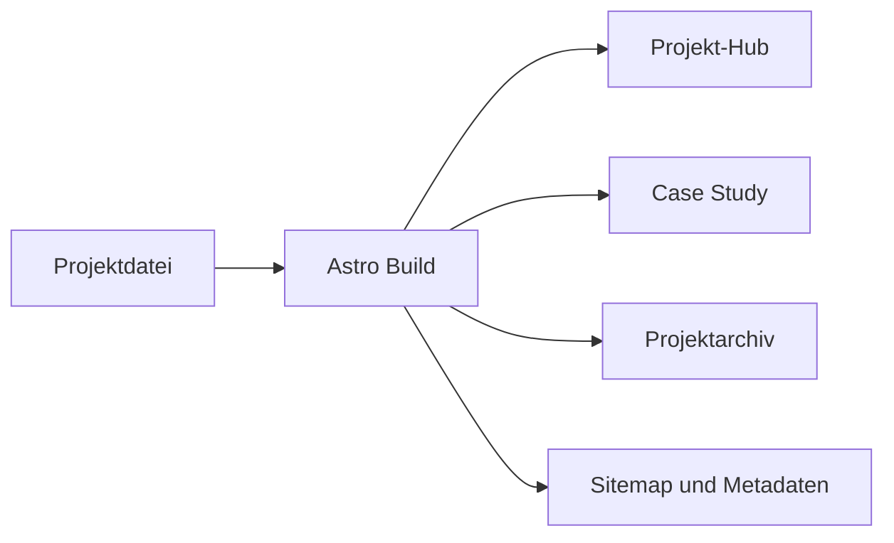

# Technische Architektur

## Entscheidung

Für die erste produktive Version wird **Astro mit TypeScript und statischer
Ausgabe** vorgeschlagen. Das passt zu GitHub Pages, hält die ausgelieferte
JavaScript-Menge klein und erlaubt trotzdem interaktive Komponenten dort, wo
der Console Hub sie wirklich benötigt.

## Geplanter Aufbau

```text
.
├── .github/
│   └── workflows/
│       ├── ci.yml
│       └── deploy-pages.yml
├── public/
│   ├── favicon.svg
│   ├── images/
│   ├── robots.txt
│   └── social-card.jpg
├── src/
│   ├── components/
│   │   ├── layout/
│   │   ├── project-hub/
│   │   └── ui/
│   ├── content/
│   │   └── projects/
│   ├── layouts/
│   ├── pages/
│   │   ├── projects/[slug].astro
│   │   ├── 404.astro
│   │   ├── datenschutz.astro
│   │   ├── impressum.astro
│   │   └── index.astro
│   ├── styles/
│   │   ├── global.css
│   │   └── tokens.css
│   └── content.config.ts
├── astro.config.mjs
├── package.json
└── tsconfig.json
```

Die Struktur wird beim eigentlichen Scaffold erzeugt. Sie ist hier dokumentiert,
damit Design und Inhaltsmodell vor dem Code feststehen.

## Rendering und Interaktivität

- Alle Seiten werden zur Build-Zeit als statisches HTML erzeugt.
- Navigation, Projekttexte und Links funktionieren ohne Client-JavaScript.
- Nur der Projekt-Hub wird bei Bedarf als kleine Client-Komponente aktiviert.
- CSS übernimmt Hover, Fokus, responsive Anordnung und reduzierte Bewegung.
- Medien werden lokal gespeichert, dimensioniert und in modernen Formaten
  ausgegeben.

## Datenfluss



Eine validierte Content Collection stellt sicher, dass Pflichtfelder und Links
bereits beim Build geprüft werden.

## Styling

- Design Tokens als CSS Custom Properties;
- flüssige Schrift- und Abstandsskalen mit `clamp()`;
- komponentennahe Styles statt globaler Utility-Abhängigkeit;
- keine UI-Komponentenbibliothek für den charakteristischen Hub;
- Farbschemata und Bewegungspräferenzen werden über Medienabfragen respektiert.

## Qualitätssicherung

### Bei jedem Pull Request

- Format- und Lint-Prüfung;
- TypeScript-/Astro-Prüfung;
- Produktions-Build;
- Smoke Tests für Kernrouten und tote Links;
- automatisierter Accessibility-Basistest.

### Vor Releases

- Tastatur- und Screenreader-Smoke-Test;
- Tests bei 320 px Breite und 200 % Zoom;
- `prefers-reduced-motion` prüfen;
- Lighthouse-Messung auf Start- und Projektseite;
- Social Preview, Metadaten und 404-Seite prüfen;
- Links auf externe Projekte testen.

## Deployment

Ein Push auf `main` löst nach erfolgreichem Build den GitHub-Pages-Workflow aus.
Das Workflow-Artefakt enthält ausschließlich den generierten `dist`-Ordner.
Für die Deployment-Umgebung werden nur die minimal nötigen Berechtigungen
`contents: read`, `pages: write` und `id-token: write` vergeben.

## Bewusst vermiedene Komplexität

- kein Server und keine Datenbank;
- kein CMS im MVP;
- kein WebGL als Voraussetzung für die Navigation;
- kein Tracking oder Cookie-Banner ohne konkreten Analysebedarf;
- kein Kontaktformular mit externem Backend in der ersten Version.

Diese Entscheidungen können später geändert werden, ohne das Inhaltsmodell neu
aufzubauen.
